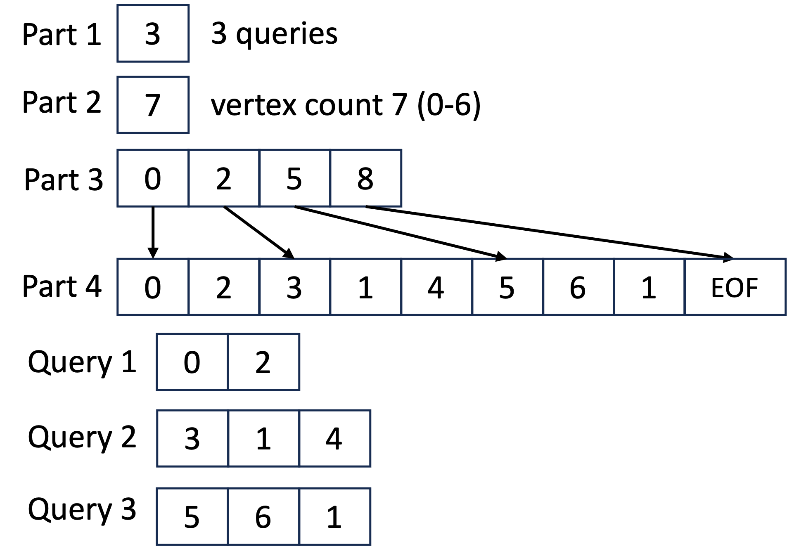

# MaxEmbed

This is the source code of the paper "MaxEmbed: Maximizing SSD bandwidth utilization for huge embedding models serving".

## How to Build

Install the dependencies:

- [vcpkg](https://github.com/microsoft/vcpkg)
- cmake
- SPDK

Run the following commands:

```
bash
cmake --preset=default
cd build
make -j
```

## How to Use

### For AE

Use the `run_all.sh` script located in the `ae_scripts` folder to execute the evaluation procedure. This script will perform the online procedure of MaxEmbed and generate the figures presented in the paper.

The `run_all.sh` script accepts a single parameter specifying the log folder.

- If you specify an existing directory, the script will use the log files in that directory to draw figures.
- If you specify a non-existing directory, the script will run the experiments, save the log files in the specified directory, and then use those logs to draw figures.

```
bash
cd ae_scripts
bash ./run_all.sh log
# bash ./run_all.sh your_dir # run this to generate log files and draw figures
```

Figures will be saved in the `<log_dir>/figures` folder.

We have provided a log in the `ae_scripts/log` folder, which you can use to draw the figures.

### Step 1: Partition Procedure

The partition program is located at `build/partition/partition_step`.

```
bash
./build/partition/partition_step <cnt_per_part> <input_file> <output_file> <binary_graph>
```

- `cnt_per_part`: The number of vertices in each partition (i.e., the number of embeddings in each page)
- `input_file`: The input hypergraph file (i.e., the embedding query logs)
- `output_file`: The output partition file
- `binary_graph`: Whether the input hypergraph file is binary or not

#### Input File Format

Plain text format:

The first line contains 4 integers: the number of vertices (C), the number of queries (N), the sum of the length of each query (Q), and an unused integer (U). The following lines contain the vertices of each query.

```
<U> <C> <N> <Q>
<vertex> <vertex> <vertex> ... <vertex>
<vertex> <vertex> <vertex> ... <vertex>
...
```

Binary input file format:

The binary input file contains 4 parts:

- Part 1: The first 8 bits are the number of queries (N).
- Part 2: The next 8 bits are the number of vertices (C).
- Part 3: The next 8 * (N + 1) bits are used to index the vertices of each query. For example, query i's index is the i-th 8 bits and the (i+1)-th 8 bits, which means the data of query i lies in the range of [index[i], index[i+1]).
- Part 4: The next 4 * Q bits are compressed data of the vertices of each query, indexed by part 3.

```
<8 bits N(num of queries)><8 bits C(num of vertices)><8 bits * (N + 1)><4 bits * Q>
```
For example:



#### Output File Format

The output of this step is a placement file, indicating which partition each vertex lies in. Because after the subsequent replication procedure, a vertex may be in multiple parts, to unify the format, we use the following method to represent a placement.

The output file contains 5 parts:

- Part 1: The first 8 bits are the number of vertices (C).
- Part 2: The next 8 bits are the sum of parts the embedding lies in (An embedding may lie in multiple parts).
- Part 3: The next 4 * C bits are the index of each vertex to the partition.
- Part 4: The next 4 * C bits are the count of each vertex to the partition.
- Part 5: Compressed data indexed by part 3 & 4.

```
<8 bits C> <8 bits Q> <4 * C bits index> <4 * C bits count> <4 * N bits>
...
```

### Step 2: Replication Procedure

The replication program is located at `build/partition/replication_step`.

```bash
./build/partition/replication_step <mapping_file> <input_file> <rep_ratio> <cnt_per_part> <output>
```

- `mapping_file`: The partition file generated by the partition procedure
- `input_file`: The same input file used in the partition procedure
- `rep_ratio`: The replication ratio
- `cnt_per_part`: The number of vertices in each partition
- `output`: The output replicated partition file

#### Output File Format

The output file format is the same as the partition file format.

### Format Conversion Tool

We provide a tool to convert the input file to binary format.

```bash
./build/partition/trans_query <input_file> <output_file>
```

This tool will convert the `input_file` to binary format and save it to the `output_file`.

### Replication Shrinking Tool

We provide a tool to generate an embedding placement with a low replication ratio from a placement with a high replication ratio. For example, you can generate a placement with a replication ratio of 0.2 from a placement with a replication ratio of 0.8.

```bash
./build/partition/shrink_replication <input_file> <output_file> <rep_ratio>
```

### Online Procedure

The online phase program is located in `build/client/client`.

```bash
./build/client/client <query_file> <mapping_file> -d <embed_dim> -n <thread_number> -b <batch_size> --delay <delay> -t <time> -s <ssd_num> -c <ratio>
```

- `query_file`: The input query file (binary format)
- `mapping_file`: The input mapping file (binary format)
- `embed_dim`: The dimension of the embedding
- `thread_number`: The number of threads
- `batch_size`: The batch size
- `delay`: The delay of the inference (used to simulate the end-to-end situation)
- `time`: The time of the online procedure; if 0, the program will run the whole query file
- `ssd_num`: The number of SSDs
- `ratio`: The cache ratio (of the whole embedding table)